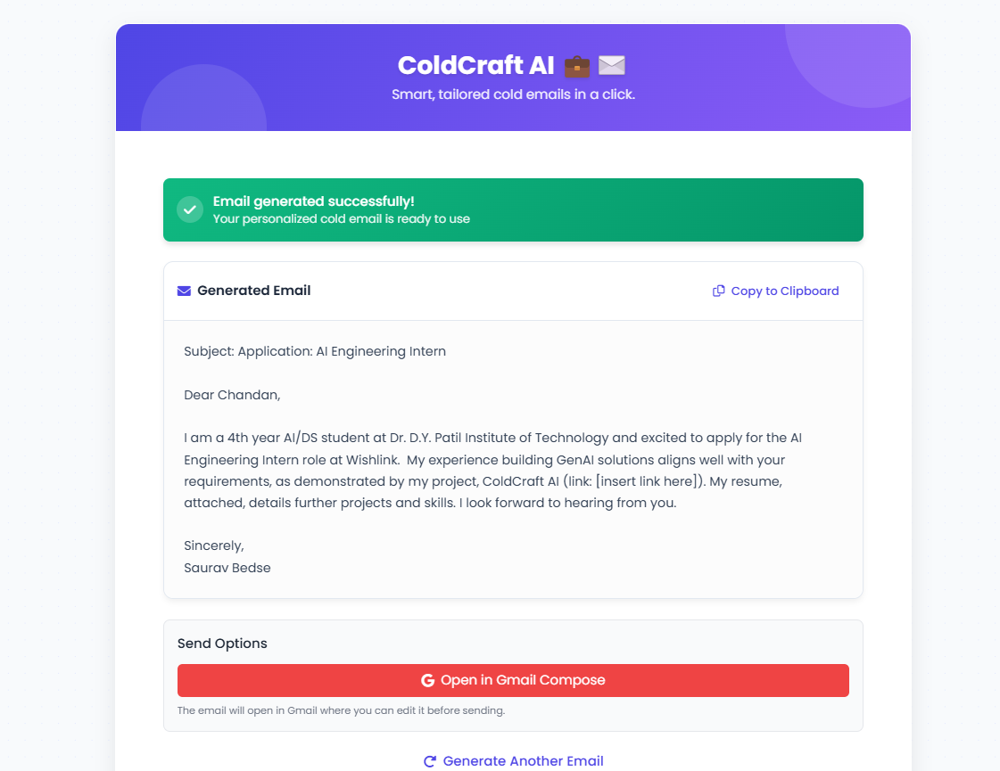

# ❄️ ColdCraft AI - Smart Cold Email Generator

ColdCraft AI is an intelligent, web-based application that automatically generates professional cold emails by analyzing your resume and a given job description. It's perfect for job seekers aiming to streamline outreach and boost their chances of landing interviews.

## 🚀 Features

- 📄 Upload your resume (PDF)
- 💼 Paste the job description
- ✉️ Get an AI-generated cold email instantly
- 🔗 Option to open the generated email directly in Gmail with pre-filled content
- 🎨 Sleek, responsive, and user-friendly interface

## 🛠 Tech Stack

- **Frontend**: HTML, CSS, Vanilla JavaScript  
- **Backend**: Python, FastAPI  
- **AI/NLP**: Custom NLP logic for parsing resume & generating email  
- **PDF Parsing**: `pdfminer.six`  
- **Deployment**: Local server via Uvicorn (Ready for cloud deployment)

## 📷 UI Snapshot

  


## 💡 How It Works

1. Upload your resume PDF.
2. Paste the job description.
3. Click "Generate Email" – ColdCraft AI uses your data to craft a customized, compelling email.
4. Optionally open it directly in Gmail for quick sending.

## 📦 Setup Instructions

```bash
git clone https://github.com/SauravBedse223/ColdCraft_AI.git
cd ColdCraft_AI
pip install -r requirements.txt
uvicorn main:app --reload
```

Then go to `http://127.0.0.1:8000` to use the app.

## 🤝 Contributions

This project was developed by [Saurav Bedse](https://www.linkedin.com/in/saurav-bedse-a24176233/).  
Feel free to fork the repo or raise issues for improvements.

---
